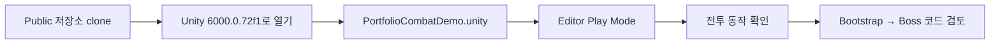
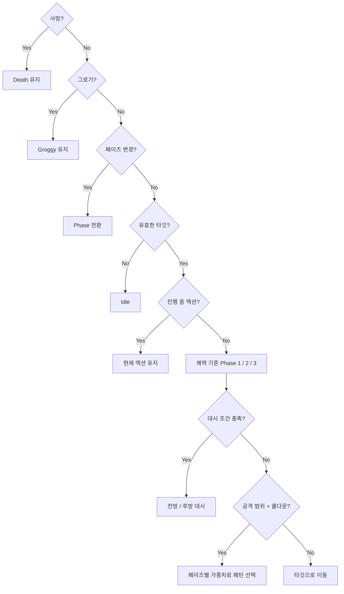
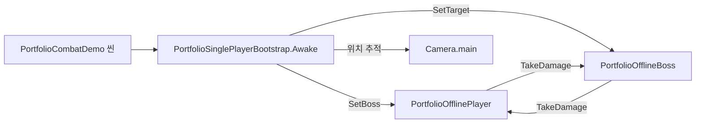
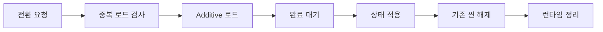

# Unity Portfolio Sample - 김혜성

> Unity/C# 게임 클라이언트 구현 역량을 공개 가능한 범위로 재구성한 포트폴리오 저장소입니다.
> 원본 팀 프로젝트의 전체 코드와 미공개 콘텐츠는 포함하지 않고, 제가 직접 설계하고 구현한 구간만 남겼습니다.

| 항목 | 내용 |
|---|---|
| 지원 직무 | 게임 클라이언트 프로그래머 |
| 주 언어 | C# |
| 엔진 | Unity 6.0.72f1 / URP 17.1.0 |
| 증명 범위 | 보스 AI 행동트리, 씬 수명주기 아키텍처, 시설 상태·UI 단방향 갱신 |

---

## 이 저장소를 3분 안에 보는 방법

이 저장소의 플레이 기준은 **Public 저장소 clone → Unity 6000.0.72f1 → 데모 씬 Play Mode**입니다.
별도 실행 파일이나 WebGL 빌드는 제공하지 않으며, 최초 실행에는 해당 Unity Editor 설치와 패키지 import가 필요합니다.

| 시간 | 무엇을 | 어디를 |
|---|---|---|
| 0:00–0:30 | 담당 범위와 제외 범위 확인 | [CONTRIBUTIONS.md](CONTRIBUTIONS.md) |
| 0:30–1:30 | 보스 전투를 Editor Play Mode로 확인 | [PortfolioCombatDemo.unity](Assets/MuloroCombatDemo/Scenes/PortfolioCombatDemo.unity) |
| 1:30–2:30 | 런타임 연결과 보스 의사결정 코드 확인 | [PortfolioSinglePlayerBootstrap.cs](Assets/MuloroCombatDemo/Scripts/Portfolio/PortfolioSinglePlayerBootstrap.cs) → [PortfolioOfflineBoss.cs](Assets/MuloroCombatDemo/Scripts/Portfolio/PortfolioOfflineBoss.cs) |
| 2:30–3:00 | 순수 C# 씬 수명주기 샘플과 검토 질문 확인 | [SceneFlow](src/Yakchonara.PortfolioSample/SceneFlow/) → [REVIEW_GUIDE.md](docs/REVIEW_GUIDE.md) |



코드 한 파일만 본다면 [PortfolioOfflineBoss.cs](Assets/MuloroCombatDemo/Scripts/Portfolio/PortfolioOfflineBoss.cs)를 권합니다.

---

## Sample 1. Muloro Combat Demo - 보스 AI

협동 로그라이크 `크로스 X 크로서`의 보스 `Belphegor`를 멀티플레이 런타임 없이 단독 실행할 수 있게 분리한 데모입니다.

### 설계 의도

보스에 패턴을 추가할 때마다 기존 상태 판정이 흔들리는 문제를 막는 것이 목표였습니다.
그래서 우선순위가 높은 상태를 Selector 상단에 고정하고, 하위에서만 공격을 선택하도록 계층을 나눴습니다.



Selector는 위에서 아래 순서로 평가하고, 처음 `Failure`가 아닌 노드의 결과를 사용합니다.
따라서 사망·그로기·페이즈 전환이 일반 전투 행동보다 항상 먼저 처리됩니다.

### 페이즈별 공격 가중치

코드에 상수로 명시했습니다. 값을 바꿀 때 어디를 봐야 하는지 분명하게 만들려는 의도입니다.

| 페이즈 | 구성 | 값 |
|---|---|---|
| Phase 1 | 기본 공격군 | `smash1`, `punch4`, `starfinger` |
| Phase 2 | 기본 / 콤보 | 40 / 60 |
| Phase 3 | 기본 / 스매시콤보 / 펀치-스타핑거 / 펀치대시콤보 | 10 / 40 / 30 / 20 |

### 거리 조건과 예외 처리

| 상수 | 값 | 의미 |
|---|---|---|
| `ForwardDashDistanceThreshold` | 5.0 | 이 거리 이상이면 전방 대시 |
| `BackDashDistanceThreshold` | 1.0 | 이 거리 이내면 후방 대시 |
| `ForcedBackDashHealthPercent` | 0.3 | 체력 30% 이하에서 후방 대시 강제 |
| `StarFingerFollowUpDamageDelay` | 0.15 | 후속 애니메이션 데미지 타이밍 |

### 실행

1. Public 저장소를 clone합니다.
2. Unity Hub에서 **Unity 6000.0.72f1**로 프로젝트 루트를 엽니다.
3. [PortfolioCombatDemo.unity](Assets/MuloroCombatDemo/Scenes/PortfolioCombatDemo.unity)를 엽니다.
4. Editor의 Play 버튼을 누릅니다.

Play를 누르면 플레이어가 보스 Belphegor와 전투하는 상태로 시작합니다.
`PortfolioSinglePlayerBootstrap`이 씬의 플레이어와 보스를 서로 연결하고 카메라를 플레이어에 붙입니다.

| 조작 | 동작 |
|---|---|
| `WASD` / 방향키 | 플레이어 이동 |
| `Space` / 마우스 좌클릭 | 범위 안의 보스 공격 |



### 씬 상태 검증

Unity Editor UI를 열지 않고도 `batchmode`로 씬 구성을 검사할 수 있습니다.
Unity Editor 설치와 유효한 라이선스는 필요하며, 아래 검사는 Play Mode 자체가 아니라 참조·컴포넌트·Build Settings 상태를 확인합니다.

```powershell
& "C:\Program Files\Unity\Hub\Editor\6000.0.72f1\Editor\Unity.exe" `
  -batchmode -nographics -projectPath . `
  -executeMethod Muloro.Portfolio.EditorTools.PortfolioDemoValidator.Validate `
  -logFile validate.log
```

로그에서 아래를 확인합니다. 종료 코드 0이면 통과입니다.

```
[VALIDATE] loaded=True
[VALIDATE] missingScriptCount=0
[VALIDATE] player=1
[VALIDATE] boss=1
[VALIDATE] bootstrap=1
[VALIDATE] mainCamera=True
[VALIDATE] RESULT=PASS
```

검증 코드는 `Assets/MuloroCombatDemo/Editor/PortfolioDemoValidator.cs`입니다.

### 담당 경계

| 구분 | 내용 |
|---|---|
| 직접 구현 | 보스 행동트리, 페이즈 전환, 대시 조건, 그로기 처리, 후속 데미지 타이밍, 오프라인 데모 재구성 |
| 직접 구현 아님 | 캐릭터·스킬 콘텐츠, UI 화면, 아트·애니메이션·사운드 원본 리소스 |

---

## Sample 2. Yakchonara Architecture - 씬 수명주기와 상태 흐름

6인 Unity 프로젝트 `약초나라`에서 제가 작성한 씬 아키텍처를 순수 C#으로 재구성한 샘플입니다.
Unity 의존성을 제거해 `dotnet run` 만으로 흐름을 확인할 수 있습니다.

### 해결한 문제

네 개의 씬을 여섯 명이 동시에 작업하면 계속 충돌했습니다.
또 비동기 씬 전환에서 로드가 끝나기 전에 상태를 넘기면 초기화되지 않은 오브젝트를 참조했습니다.

전환 순서를 한 곳에 모아 해결했습니다.



더 자세한 상태·시설·UI 흐름은 [docs/ARCHITECTURE.md](docs/ARCHITECTURE.md)에서 확인할 수 있습니다.

### 검토 경로

| 디렉터리 | 무엇을 볼 수 있는지 |
|---|---|
| `src/Yakchonara.PortfolioSample/SceneFlow/` | 씬 전환 책임을 한 곳으로 모은 구조 |
| `src/Yakchonara.PortfolioSample/Facility/` | 시설 공통 계약과 시설별 규칙 분리 |
| `src/Yakchonara.PortfolioSample/Elemental/` | 상태 전이와 부모 변경 부작용 처리 |
| `src/Yakchonara.PortfolioSample/UI/` | 상태 snapshot 기반 단방향 UI 갱신 |

### 실행

```powershell
dotnet build Yakchonara.PortfolioSample.sln
dotnet run --project samples/Yakchonara.PortfolioSample.Demo
```

출력에서 씬 등록, 시설 배정, 정령 배치, UI 갱신, 씬 해제 순서를 확인할 수 있습니다.

### 담당 경계

| 구분 | 내용 |
|---|---|
| 직접 구현 | 싱글톤 수명주기 3계층 분리, 비동기 씬 전환 순서 보장, 시설 공통 계약, 상태-UI 단방향 갱신 |
| 직접 구현 아님 | 각 콘텐츠 씬 내부 게임플레이 로직 전반, 아트·사운드 |

---

## 관련 프로젝트

| 저장소 | 내용 |
|---|---|
| [gamejam-handicraft_trainer](https://github.com/digdagdac/gamejam-handicraft_trainer) | 게임잼 작품과 ML-Agents 학습 환경 재구성 실험 |

---

## 공개 범위

이 저장소는 포트폴리오 검토용입니다.
원본 프로젝트의 전체 에셋, 전체 게임 데이터, 네트워크 런타임, 운영 설정은 포함하지 않습니다.
팀 전체 구현을 개인 구현으로 표기하지 않으며, 담당 경계는 각 섹션과 [CONTRIBUTIONS.md](CONTRIBUTIONS.md)에 명시했습니다.
