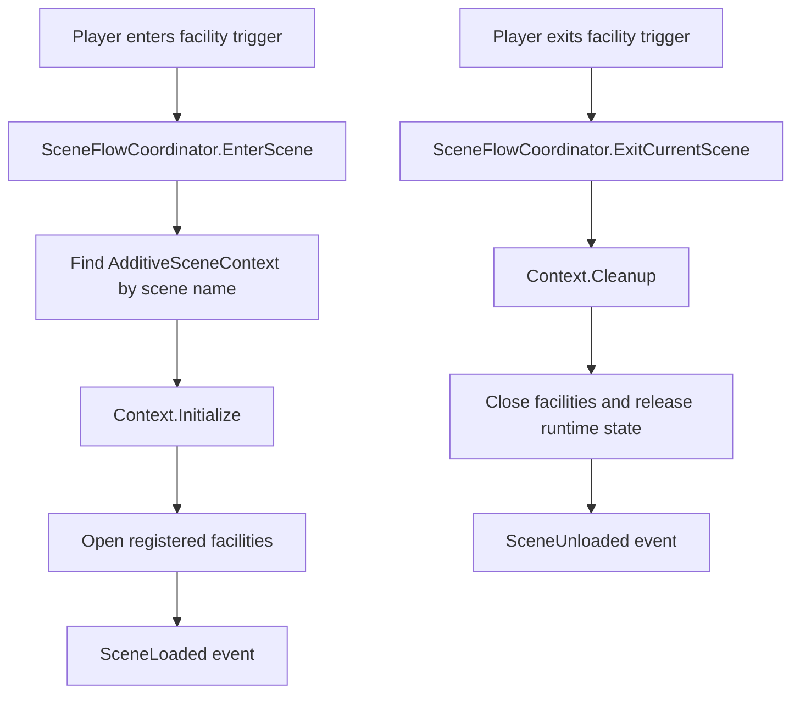
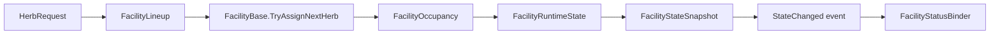
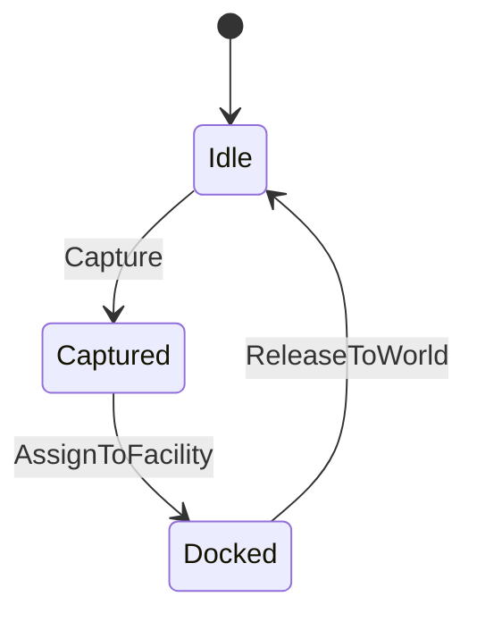
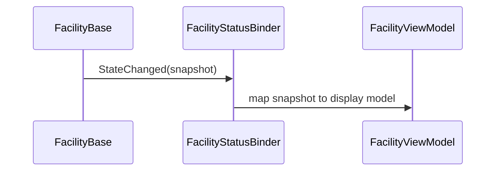

# Architecture

이 문서는 샘플 코드에서 보여주려는 핵심 흐름만 정리합니다. 원본 Unity 프로젝트의 전체 구조가 아니라, 공개 가능한 코드 리뷰용 축약 구조입니다.

## Additive Scene Flow

핵심은 입장 트리거와 퇴장 트리거가 씬 로드, UI 표시, 시설 정리를 직접 처리하지 않는 것입니다. 씬 전환은 `SceneFlowCoordinator`, 씬 내부 초기화와 정리는 `AdditiveSceneContext`가 담당합니다.

## Facility State Flow

`FacilityBase`는 시설 공통 흐름을 담당합니다. Bath와 Sauna는 같은 배정 흐름을 쓰지만, 온도나 게이지 같은 시설별 규칙은 각 하위 클래스가 처리합니다.

## Elemental To Facility Flow

정령은 부모 변경과 scale 변경이 같이 일어나는 객체입니다. 샘플에서는 `ElementalAgent`가 `DefaultScale`과 `CurrentScale`을 소유해 시설에서 빠져나올 때 복원 책임을 명확히 합니다.

## UI Binding Flow

UI는 시설 내부 컬렉션이나 세션 컨트롤러를 직접 읽지 않습니다. `FacilityStateSnapshot`만 받아 표시용 모델로 바꾸므로, 시설 구조가 바뀌어도 UI 영향 범위를 줄일 수 있습니다.
